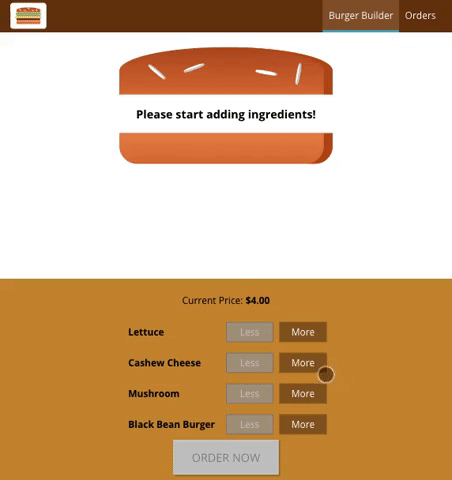

# Burger Builder

## Table of Contents
* [Run Burger Builder Locally](#run-burger-builder-locally)
* [Instructions](#instructions)
* [Built With](#built-with)

## Run Burger Builder Locally

In the project directory, you can run:

### `npm install`

This will add all the necessary files to the project in order to run it.

### `npm start`

Runs the app in the development mode.
Open [http://localhost:3000](http://localhost:3000) to view it in the browser.

## Instructions

Add and remove ingredients to your burger, continue on to the checkout process. After adding contact information the app will upload your order to the server and then will display it on the orders page!

## Built With

* [React](https://reactjs.org/) - UI library
* [Redux](https://redux.js.org/) - Predicatable state container
* [axios](https://github.com/axios/axios) - Promise based HTTP client for the browser and node.js
* [Firebase](https://firebase.google.com/) - Mobile and web application development platform

